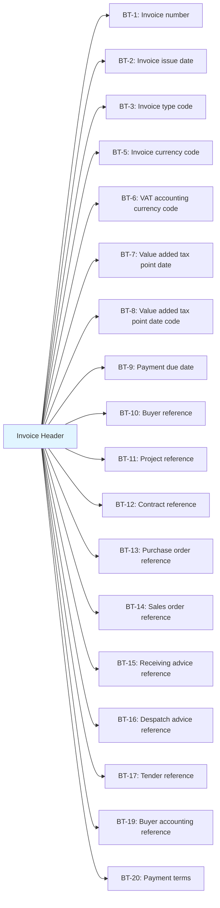
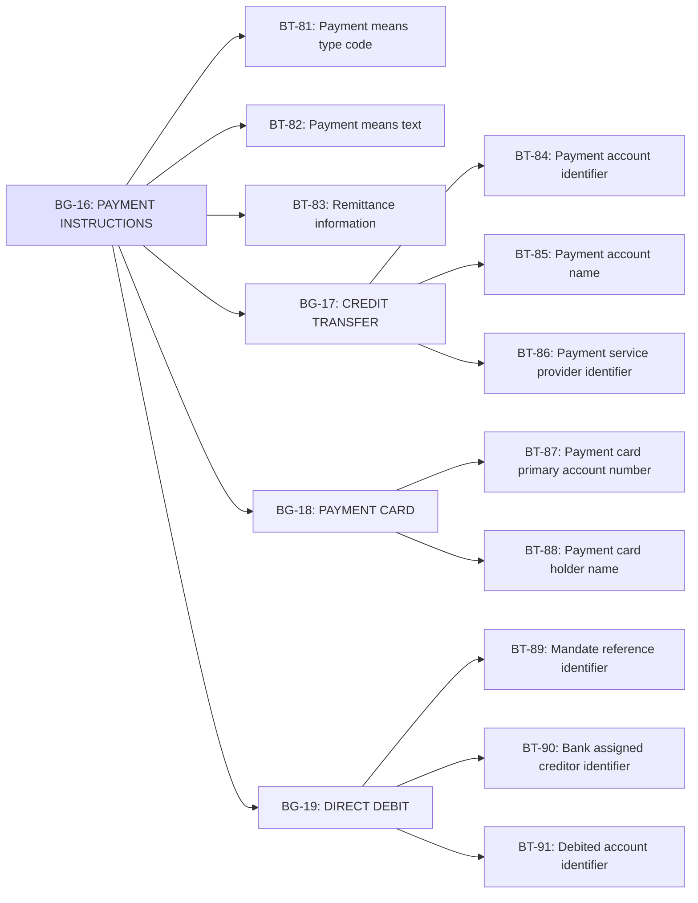
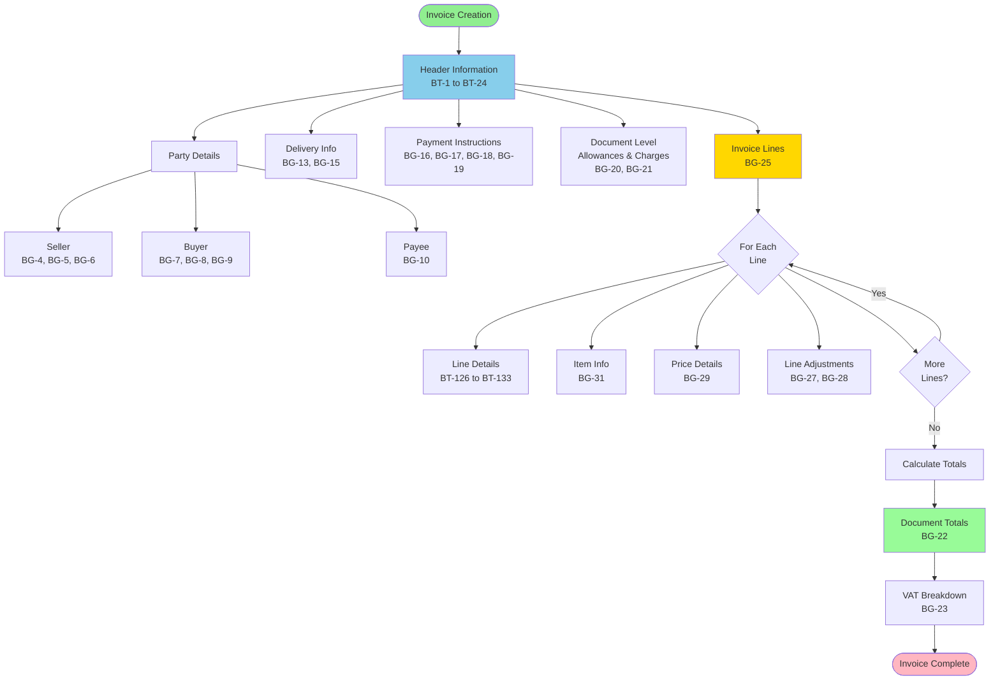
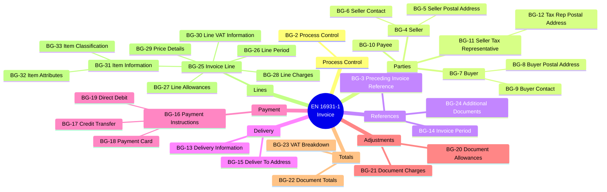
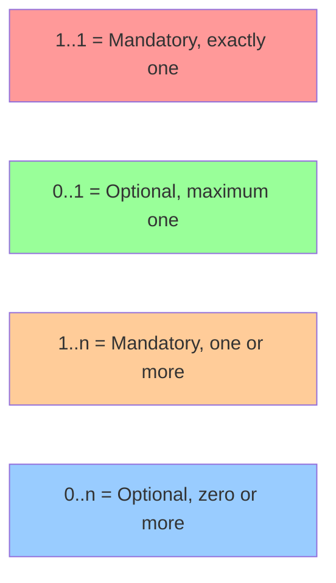

# EN 16931-1 eInvoice Data Model - Mermaid Diagrams

## Core Invoice Structure

```mermaid
graph TB
    Invoice[EN 16931-1 Invoice]
    
    Invoice --> BG1[BG-1: INVOICE NOTE]
    Invoice --> BG2[BG-2: PROCESS CONTROL]
    Invoice --> BG3[BG-3: PRECEDING INVOICE REFERENCE]
    Invoice --> BG4[BG-4: SELLER]
    Invoice --> BG5[BG-5: SELLER POSTAL ADDRESS]
    Invoice --> BG6[BG-6: SELLER CONTACT]
    Invoice --> BG7[BG-7: BUYER]
    Invoice --> BG8[BG-8: BUYER POSTAL ADDRESS]
    Invoice --> BG9[BG-9: BUYER CONTACT]
    Invoice --> BG10[BG-10: PAYEE]
    Invoice --> BG11[BG-11: SELLER TAX REPRESENTATIVE]
    Invoice --> BG13[BG-13: DELIVERY INFORMATION]
    Invoice --> BG15[BG-15: DELIVER TO ADDRESS]
    Invoice --> BG16[BG-16: PAYMENT INSTRUCTIONS]
    Invoice --> BG17[BG-17: CREDIT TRANSFER]
    Invoice --> BG18[BG-18: PAYMENT CARD]
    Invoice --> BG19[BG-19: DIRECT DEBIT]
    Invoice --> BG20[BG-20: DOCUMENT LEVEL ALLOWANCES]
    Invoice --> BG21[BG-21: DOCUMENT LEVEL CHARGES]
    Invoice --> BG22[BG-22: DOCUMENT TOTALS]
    Invoice --> BG23[BG-23: VAT BREAKDOWN]
    Invoice --> BG25[BG-25: INVOICE LINE]
    Invoice --> BG26[BG-26: INVOICE LINE PERIOD]
    Invoice --> BG27[BG-27: INVOICE LINE ALLOWANCES]
    Invoice --> BG28[BG-28: INVOICE LINE CHARGES]
    Invoice --> BG29[BG-29: PRICE DETAILS]
    Invoice --> BG30[BG-30: LINE VAT INFORMATION]
    Invoice --> BG31[BG-31: ITEM INFORMATION]
    
    style Invoice fill:#e1f5ff
    style BG4 fill:#ffe1e1
    style BG7 fill:#ffe1e1
    style BG22 fill:#e1ffe1
    style BG25 fill:#fff4e1
```

## Invoice Header Details

## Party Information (Seller)

```mermaid
graph TB
    Seller[BG-4: SELLER]
    
    Seller --> BT27[BT-27: Seller name]
    Seller --> BT28[BT-28: Seller trading name]
    Seller --> BT29[BT-29: Seller identifier]
    Seller --> BT30[BT-30: Seller legal registration identifier]
    Seller --> BT31[BT-31: Seller VAT identifier]
    Seller --> BT32[BT-32: Seller tax registration identifier]
    Seller --> BT33[BT-33: Seller additional legal information]
    Seller --> BT34[BT-34: Seller electronic address]
    
    Seller --> Address[BG-5: SELLER POSTAL ADDRESS]
    Address --> BT35[BT-35: Seller address line 1]
    Address --> BT36[BT-36: Seller address line 2]
    Address --> BT37[BT-37: Seller address line 3]
    Address --> BT38[BT-38: Seller city]
    Address --> BT39[BT-39: Seller post code]
    Address --> BT40[BT-40: Seller country subdivision]
    Address --> BT41[BT-41: Seller country code]
    
    Seller --> Contact[BG-6: SELLER CONTACT]
    Contact --> BT42[BT-42: Seller contact point]
    Contact --> BT43[BT-43: Seller contact telephone]
    Contact --> BT44[BT-44: Seller contact email]
    
    style Seller fill:#ffe1e1
    style Address fill:#ffeeee
    style Contact fill:#ffeeee
```

## Invoice Line Structure

```mermaid
graph TB
    Line[BG-25: INVOICE LINE]
    
    Line --> BT126[BT-126: Invoice line identifier]
    Line --> BT127[BT-127: Invoice line note]
    Line --> BT128[BT-128: Invoice line object identifier]
    Line --> BT129[BT-129: Invoiced quantity]
    Line --> BT130[BT-130: Invoiced quantity unit]
    Line --> BT131[BT-131: Invoice line net amount]
    Line --> BT132[BT-132: Referenced purchase order line]
    Line --> BT133[BT-133: Buyer accounting reference]
    
    Line --> Period[BG-26: INVOICE LINE PERIOD]
    Period --> BT134[BT-134: Line period start date]
    Period --> BT135[BT-135: Line period end date]
    
    Line --> Allowance[BG-27: LINE ALLOWANCES]
    Allowance --> BT136[BT-136: Line allowance amount]
    Allowance --> BT137[BT-137: Line allowance base amount]
    Allowance --> BT138[BT-138: Line allowance percentage]
    Allowance --> BT139[BT-139: Line allowance reason code]
    Allowance --> BT140[BT-140: Line allowance reason]
    
    Line --> Charge[BG-28: LINE CHARGES]
    Charge --> BT141[BT-141: Line charge amount]
    Charge --> BT142[BT-142: Line charge base amount]
    Charge --> BT143[BT-143: Line charge percentage]
    Charge --> BT144[BT-144: Line charge reason code]
    Charge --> BT145[BT-145: Line charge reason]
    
    Line --> Price[BG-29: PRICE DETAILS]
    Price --> BT146[BT-146: Item net price]
    Price --> BT147[BT-147: Item price discount]
    Price --> BT148[BT-148: Item gross price]
    Price --> BT149[BT-149: Item price base quantity]
    Price --> BT150[BT-150: Item price base quantity unit]
    
    Line --> VAT[BG-30: LINE VAT INFORMATION]
    VAT --> BT151[BT-151: Invoiced item VAT category code]
    VAT --> BT152[BT-152: Invoiced item VAT rate]
    
    Line --> Item[BG-31: ITEM INFORMATION]
    Item --> BT153[BT-153: Item name]
    Item --> BT154[BT-154: Item description]
    Item --> BT155[BT-155: Item seller's identifier]
    Item --> BT156[BT-156: Item buyer's identifier]
    Item --> BT157[BT-157: Item standard identifier]
    Item --> BT158[BT-158: Item classification identifier]
    Item --> BT159[BT-159: Item country of origin]
    
    style Line fill:#fff4e1
    style Price fill:#ffffcc
    style Item fill:#e1ffe1
```

## Document Totals and VAT

```mermaid
graph TB
    Totals[BG-22: DOCUMENT TOTALS]
    
    Totals --> BT106[BT-106: Sum of Invoice line net amount]
    Totals --> BT107[BT-107: Sum of allowances on document level]
    Totals --> BT108[BT-108: Sum of charges on document level]
    Totals --> BT109[BT-109: Invoice total amount without VAT]
    Totals --> BT110[BT-110: Invoice total VAT amount]
    Totals --> BT111[BT-111: Invoice total VAT amount in accounting currency]
    Totals --> BT112[BT-112: Invoice total amount with VAT]
    Totals --> BT113[BT-113: Paid amount]
    Totals --> BT114[BT-114: Rounding amount]
    Totals --> BT115[BT-115: Amount due for payment]
    
    VAT[BG-23: VAT BREAKDOWN]
    
    VAT --> BT116[BT-116: VAT category taxable amount]
    VAT --> BT117[BT-117: VAT category tax amount]
    VAT --> BT118[BT-118: VAT category code]
    VAT --> BT119[BT-119: VAT category rate]
    VAT --> BT120[BT-120: VAT exemption reason code]
    VAT --> BT121[BT-121: VAT exemption reason text]
    
    style Totals fill:#e1ffe1
    style VAT fill:#ffe1ff
```

## Payment Instructions Flow

## Complete Invoice Information Flow

## EN 16931-1 Business Groups (BG) Overview

## Cardinality Legend

