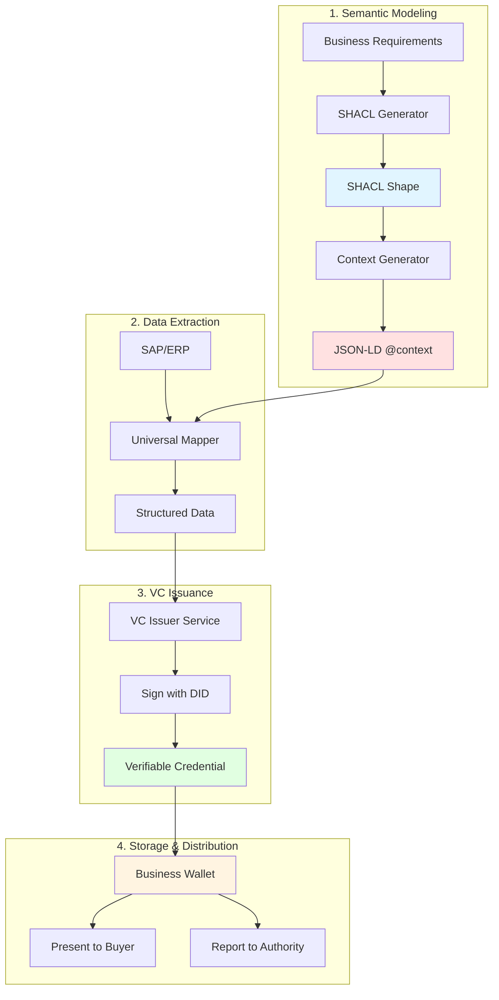
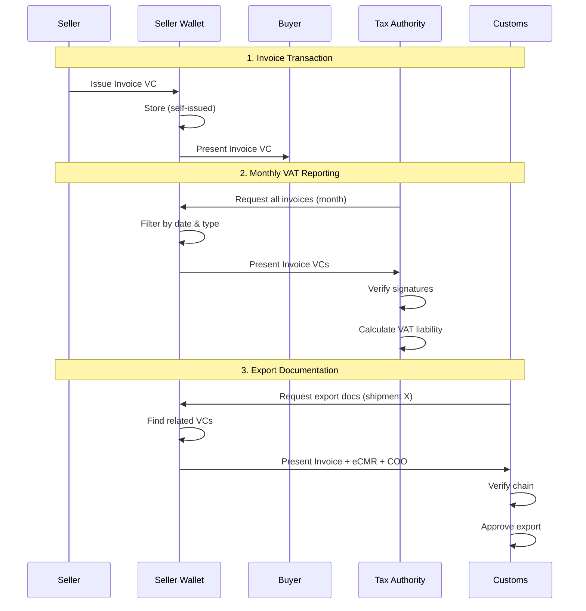

# Semantic Modeling Process for W3C VC Business Documents

**From Business Requirements to Verifiable Credentials**

## Executive Summary

This document defines a comprehensive, scalable process for transforming any business document into a W3C Verifiable Credential, using semantic web technologies (SHACL, JSON-LD) and ontology-based modeling.

### Process Overview

```
Business Requirements
        ↓
SHACL Shape Definition
        ↓
JSON-LD @context Generation
        ↓
Data Extraction (SAP/ERP)
        ↓
VC Issuance (Self-Issued)
        ↓
Wallet Storage & Presentation
```

---

## 1. The Semantic Modeling Workflow

### 1.1 Foundation: Vocabulary Selection

**Primary Vocabularies**:
- **busdoc** (https://iri.suomi.fi/model/busdoc/) - Finnish business documents
- **UN/CEFACT BSP** (https://vocabulary.uncefact.org/) - International trade
- **Schema.org** (https://schema.org/) - General business entities
- **W3C ORG** (https://www.w3.org/TR/vocab-org/) - Organizations
- **GoodRelations** (http://purl.org/goodrelations/) - E-commerce

**Vocabulary Platform**:
- **Tietomallit.suomi.fi** - Finnish national data model platform
- **EBSI** - European Blockchain Services Infrastructure vocabularies
- **Custom ontologies** - Domain-specific extensions

---

## 2. SHACL-Based Modeling Approach

### 2.1 Why SHACL?

**SHACL (Shapes Constraint Language)** provides:
- ✅ **Declarative validation** - Rules expressed as RDF triples
- ✅ **Inheritance** - Shapes can extend other shapes
- ✅ **Constraints** - Cardinality, datatypes, patterns
- ✅ **Multi-vocabulary** - Can reference any ontology
- ✅ **Machine-readable** - Direct transformation to JSON Schema
- ✅ **Tooling** - Rich ecosystem (TopBraid, pySHACL)

### 2.2 SHACL Shape Structure

```turtle
@prefix sh: <http://www.w3.org/ns/shacl#> .
@prefix unece: <https://vocabulary.uncefact.org/> .
@prefix busdoc: <https://iri.suomi.fi/model/busdoc/> .
@prefix xsd: <http://www.w3.org/2001/XMLSchema#> .

# Shape for eInvoice
:InvoiceShape a sh:NodeShape ;
    sh:targetClass unece:Invoice ;
    sh:property [
        sh:path busdoc:invoiceNumber ;
        sh:datatype xsd:string ;
        sh:minCount 1 ;
        sh:maxCount 1 ;
        sh:name "Invoice number" ;
        sh:description "Unique identifier for the invoice" ;
    ] ;
    sh:property [
        sh:path busdoc:issueDate ;
        sh:datatype xsd:date ;
        sh:minCount 1 ;
        sh:maxCount 1 ;
    ] ;
    sh:property [
        sh:path busdoc:seller ;
        sh:class unece:TradeParty ;
        sh:minCount 1 ;
        sh:maxCount 1 ;
        sh:node :PartyShape ;
    ] .

# Reusable Party shape
:PartyShape a sh:NodeShape ;
    sh:targetClass unece:TradeParty ;
    sh:property [
        sh:path busdoc:name ;
        sh:datatype xsd:string ;
        sh:minCount 1 ;
    ] ;
    sh:property [
        sh:path busdoc:address ;
        sh:class unece:TradeAddress ;
        sh:node :AddressShape ;
    ] .
```

---

## 3. Automated SHACL Generation

### 3.1 Input: Business Requirements Document

**Example Input (YAML)**:

```yaml
document:
  name: PurchaseOrder
  version: 1.0
  description: Electronic purchase order for goods or services
  base_vocabulary: unece
  additional_vocabularies:
    - busdoc
    - schema

fields:
  - name: orderNumber
    source: unece:id
    datatype: xsd:string
    cardinality: 1..1
    description: Unique purchase order identifier
    
  - name: orderDate
    source: unece:issueDateTime
    datatype: xsd:dateTime
    cardinality: 1..1
    
  - name: buyer
    source: unece:buyerParty
    type: Party
    cardinality: 1..1
    constraints:
      - must_have_address
      - must_have_tax_id
      
  - name: seller
    source: unece:sellerParty
    type: Party
    cardinality: 1..1
    
  - name: orderLines
    source: unece:orderLine
    type: OrderLine
    cardinality: 1..n

types:
  Party:
    fields:
      - name: name
        source: unece:name
        datatype: xsd:string
        cardinality: 1..1
        
      - name: taxID
        source: busdoc:taxRegistrationID
        datatype: xsd:string
        cardinality: 0..1
        pattern: "^[A-Z]{2}[0-9A-Z]{2,13}$"
        
      - name: address
        source: unece:postalAddress
        type: Address
        cardinality: 1..1
        
  OrderLine:
    fields:
      - name: lineNumber
        source: unece:sequenceNumeric
        datatype: xsd:integer
        cardinality: 1..1
        
      - name: quantity
        source: unece:quantity
        datatype: xsd:decimal
        cardinality: 1..1
        minimum: 0.01
```

### 3.2 SHACL Generator Algorithm

**Process**:
1. Parse business requirements (YAML/JSON)
2. Resolve vocabulary references (load from tietomallit.suomi.fi or URLs)
3. Generate SHACL shapes for each document type
4. Generate SHACL shapes for reusable types
5. Add constraints (cardinality, datatypes, patterns)
6. Validate generated SHACL (self-validation)
7. Output SHACL Turtle file

**Implementation**:

```typescript
class SHACLGenerator {
  async generateFromRequirements(
    requirements: BusinessRequirements
  ): Promise<string> {
    const shapes: SHACLShape[] = [];
    
    // 1. Load vocabularies
    const vocabs = await this.loadVocabularies(
      requirements.additional_vocabularies
    );
    
    // 2. Generate main document shape
    const docShape = this.createDocumentShape(
      requirements.document,
      requirements.fields,
      vocabs
    );
    shapes.push(docShape);
    
    // 3. Generate type shapes
    for (const [typeName, typeDef] of Object.entries(requirements.types)) {
      const typeShape = this.createTypeShape(typeName, typeDef, vocabs);
      shapes.push(typeShape);
    }
    
    // 4. Serialize to Turtle
    return this.serializeToTurtle(shapes);
  }
  
  private createDocumentShape(
    doc: DocumentDef,
    fields: FieldDef[],
    vocabs: Vocabulary[]
  ): SHACLShape {
    const shape = new SHACLShape(doc.name);
    
    for (const field of fields) {
      const property = new PropertyConstraint({
        path: field.source,
        datatype: field.datatype,
        minCount: this.parseCardinality(field.cardinality).min,
        maxCount: this.parseCardinality(field.cardinality).max,
        name: field.name,
        description: field.description
      });
      
      // Add pattern if specified
      if (field.pattern) {
        property.pattern = field.pattern;
      }
      
      // Add range constraints for numbers
      if (field.minimum !== undefined) {
        property.minInclusive = field.minimum;
      }
      
      shape.addProperty(property);
    }
    
    return shape;
  }
}
```

---

## 4. JSON-LD Context Generation from SHACL

### 4.1 Transformation Rules

**SHACL Property → JSON-LD Term**:

| SHACL Element | JSON-LD Context Element |
|---------------|------------------------|
| `sh:path` | Term IRI (`@id`) |
| `sh:datatype xsd:string` | `@type: "xsd:string"` |
| `sh:datatype xsd:date` | `@type: "xsd:date"` |
| `sh:class` | `@type: "@id"` (reference) |
| `sh:name` | Comment (optional) |

### 4.2 Context Generator

**Input (SHACL Turtle)**:
```turtle
:InvoiceShape a sh:NodeShape ;
    sh:property [
        sh:path busdoc:invoiceNumber ;
        sh:datatype xsd:string ;
    ] ;
    sh:property [
        sh:path busdoc:seller ;
        sh:class unece:TradeParty ;
    ] .
```

**Output (JSON-LD Context)**:
```json
{
  "@context": {
    "busdoc": "https://iri.suomi.fi/model/busdoc/",
    "unece": "https://vocabulary.uncefact.org/",
    "xsd": "http://www.w3.org/2001/XMLSchema#",
    
    "Invoice": {
      "@id": "busdoc:Invoice",
      "@context": {
        "invoiceNumber": {
          "@id": "busdoc:invoiceNumber",
          "@type": "xsd:string"
        },
        "seller": {
          "@id": "busdoc:seller",
          "@type": "@id"
        }
      }
    }
  }
}
```

**Implementation**:

```typescript
class ContextGenerator {
  async generateFromSHACL(shaclTurtle: string): Promise<object> {
    // 1. Parse SHACL Turtle
    const shapes = await this.parseSHACL(shaclTurtle);
    
    // 2. Extract namespaces
    const namespaces = this.extractNamespaces(shapes);
    
    // 3. Build context
    const context: any = {};
    
    // Add namespace prefixes
    for (const [prefix, uri] of Object.entries(namespaces)) {
      context[prefix] = uri;
    }
    
    // 4. Generate terms from shapes
    for (const shape of shapes) {
      const shapeContext = this.generateShapeContext(shape);
      Object.assign(context, shapeContext);
    }
    
    return { "@context": context };
  }
  
  private generateShapeContext(shape: SHACLShape): object {
    const termContext: any = {};
    
    for (const property of shape.properties) {
      const term = this.pathToTerm(property.path);
      
      termContext[term] = {
        "@id": property.path
      };
      
      // Add type
      if (property.datatype) {
        termContext[term]["@type"] = this.mapDatatype(property.datatype);
      } else if (property.classRef) {
        termContext[term]["@type"] = "@id"; // Object reference
      }
      
      // Add container for arrays
      if (property.maxCount > 1 || property.maxCount === null) {
        termContext[term]["@container"] = "@list";
      }
    }
    
    return {
      [shape.name]: {
        "@id": shape.targetClass,
        "@context": termContext
      }
    };
  }
}
```

---

## 5. Universal SAP/ERP Mapper

### 5.1 Configuration-Driven Mapping

**Mapping Configuration (YAML)**:

```yaml
mapping:
  document: Invoice
  source: SAP
  target: W3C_VC
  
  header:
    - sap_table: VBRK
      sap_field: VBELN
      vc_path: credentialSubject.invoiceNumber
      transformation: trim
      
    - sap_table: VBRK
      sap_field: FKDAT
      vc_path: credentialSubject.issueDate
      transformation: date_to_iso8601
      
    - sap_table: VBRK
      sap_field: WAERK
      vc_path: credentialSubject.documentCurrencyCode
      transformation: none
      
  parties:
    seller:
      sap_table: T001
      key_field: BUKRS
      mappings:
        - sap_field: BUTXT
          vc_path: credentialSubject.seller.name
          
    buyer:
      sap_table: KNA1
      key_field: KUNNR
      key_from: VBRK.KUNAG
      mappings:
        - sap_field: NAME1
          vc_path: credentialSubject.buyer.name
        - sap_field: STRAS
          vc_path: credentialSubject.buyer.address.streetName
        - sap_field: ORT01
          vc_path: credentialSubject.buyer.address.cityName
          
  line_items:
    sap_table: VBRP
    key_field: VBELN
    key_from: VBRK.VBELN
    array_path: credentialSubject.invoiceLine
    mappings:
      - sap_field: POSNR
        vc_path: lineID
        transformation: to_string
      - sap_field: FKIMG
        vc_path: invoicedQuantity.value
        transformation: to_decimal
      - sap_field: VRKME
        vc_path: invoicedQuantity.unitCode
      - sap_field: NETWR
        vc_path: lineExtensionAmount

transformations:
  date_to_iso8601:
    type: function
    code: |
      (sapDate) => {
        const year = sapDate.substring(0, 4);
        const month = sapDate.substring(4, 6);
        const day = sapDate.substring(6, 8);
        return `${year}-${month}-${day}`;
      }
  
  to_decimal:
    type: function
    code: |
      (value) => parseFloat(value)
```

### 5.2 Universal Mapper Implementation

```typescript
class UniversalSAPMapper {
  private sapClient: SAPClient;
  private mappingConfig: MappingConfig;
  
  async mapToVC(invoiceNumber: string): Promise<object> {
    // 1. Load mapping configuration
    const config = await this.loadMappingConfig('Invoice');
    
    // 2. Extract data from SAP
    const sapData = await this.extractSAPData(invoiceNumber, config);
    
    // 3. Transform to VC structure
    const credentialSubject = this.transformToVC(sapData, config);
    
    return credentialSubject;
  }
  
  private async extractSAPData(
    key: string,
    config: MappingConfig
  ): Promise<any> {
    const data: any = {};
    
    // Extract header data
    for (const mapping of config.header) {
      const query = `SELECT ${mapping.sap_field} 
                     FROM ${mapping.sap_table} 
                     WHERE ${this.getKeyField(mapping.sap_table)} = :key`;
      
      const result = await this.sapClient.execute(query, { key });
      data[mapping.sap_field] = result[0][mapping.sap_field];
    }
    
    // Extract party data
    for (const [role, partyConfig] of Object.entries(config.parties)) {
      const partyKey = data[partyConfig.key_from.split('.')[1]];
      const partyData = await this.extractPartyData(partyKey, partyConfig);
      data[role] = partyData;
    }
    
    // Extract line items
    const lineItems = await this.extractLineItems(key, config.line_items);
    data.lineItems = lineItems;
    
    return data;
  }
  
  private transformToVC(sapData: any, config: MappingConfig): object {
    const vc: any = {};
    
    // Transform header fields
    for (const mapping of config.header) {
      const value = sapData[mapping.sap_field];
      const transformed = this.applyTransformation(
        value,
        mapping.transformation,
        config.transformations
      );
      
      this.setNestedValue(vc, mapping.vc_path, transformed);
    }
    
    // Transform parties
    for (const [role, partyConfig] of Object.entries(config.parties)) {
      for (const mapping of partyConfig.mappings) {
        const value = sapData[role][mapping.sap_field];
        this.setNestedValue(vc, mapping.vc_path, value);
      }
    }
    
    // Transform line items
    const lineItems: any[] = [];
    for (const sapLine of sapData.lineItems) {
      const vcLine: any = {};
      
      for (const mapping of config.line_items.mappings) {
        const value = sapLine[mapping.sap_field];
        const transformed = this.applyTransformation(
          value,
          mapping.transformation,
          config.transformations
        );
        
        this.setNestedValue(vcLine, mapping.vc_path, transformed);
      }
      
      lineItems.push(vcLine);
    }
    this.setNestedValue(vc, config.line_items.array_path, lineItems);
    
    return vc;
  }
  
  private setNestedValue(obj: any, path: string, value: any): void {
    const parts = path.split('.');
    let current = obj;
    
    for (let i = 0; i < parts.length - 1; i++) {
      if (!current[parts[i]]) {
        current[parts[i]] = {};
      }
      current = current[parts[i]];
    }
    
    current[parts[parts.length - 1]] = value;
  }
}
```

---

## 6. Multi-Document Support

### 6.1 Document Registry

**Registry Structure**:

```json
{
  "documents": [
    {
      "id": "invoice",
      "name": "Invoice",
      "version": "1.0",
      "shaclShape": "https://iri.suomi.fi/model/invoice/shape/v1",
      "jsonldContext": "https://iri.suomi.fi/model/invoice/context/v1",
      "vcType": ["VerifiableCredential", "EN16931Invoice"],
      "regulatoryAuthorities": ["tax-authority", "customs"],
      "sapMapping": "config/sap-invoice-mapping.yaml"
    },
    {
      "id": "purchase-order",
      "name": "PurchaseOrder",
      "version": "1.0",
      "shaclShape": "https://iri.suomi.fi/model/purchase-order/shape/v1",
      "jsonldContext": "https://iri.suomi.fi/model/purchase-order/context/v1",
      "vcType": ["VerifiableCredential", "PurchaseOrder"],
      "regulatoryAuthorities": [],
      "sapMapping": "config/sap-po-mapping.yaml"
    },
    {
      "id": "ecmr",
      "name": "eCMR",
      "version": "1.0",
      "shaclShape": "https://vocabulary.uncefact.org/ecmr/shape/v1",
      "jsonldContext": "https://iri.suomi.fi/model/vc-ecmr-uncefact/context/v1",
      "vcType": ["VerifiableCredential", "eCMRConsignmentNote"],
      "regulatoryAuthorities": ["customs", "transport-authority"],
      "sapMapping": "config/sap-delivery-mapping.yaml"
    },
    {
      "id": "certificate-of-origin",
      "name": "CertificateOfOrigin",
      "version": "1.0",
      "shaclShape": "https://vocabulary.uncefact.org/coo/shape/v1",
      "jsonldContext": "https://vocabulary.uncefact.org/coo/context/v1",
      "vcType": ["VerifiableCredential", "CertificateOfOrigin"],
      "regulatoryAuthorities": ["customs", "trade-authority"],
      "sapMapping": null
    }
  ]
}
```

### 6.2 Regulatory Authority Registration

**Authority Registry**:

```json
{
  "authorities": [
    {
      "id": "tax-authority",
      "name": "Finnish Tax Administration",
      "did": "did:ebsi:fi-tax-authority",
      "endpoint": "https://vero.fi/api/vc/verify",
      "requiredDocuments": ["invoice", "vat-return"],
      "reportingSchedule": "monthly",
      "accessRights": ["read", "verify"]
    },
    {
      "id": "customs",
      "name": "Finnish Customs",
      "did": "did:ebsi:fi-customs",
      "endpoint": "https://tulli.fi/api/vc/verify",
      "requiredDocuments": ["invoice", "ecmr", "certificate-of-origin"],
      "reportingSchedule": "on-demand",
      "accessRights": ["read", "verify", "request-presentation"]
    }
  ]
}
```

---

## 7. The Complete Workflow

### 7.1 Document Lifecycle



### 7.2 Regulatory Reporting Flow



---

## 8. Technology Stack

### 8.1 Semantic Modeling Tools

| Component | Technology |
|-----------|-----------|
| **SHACL Validation** | `pySHACL`, `shacl-js` |
| **RDF Processing** | `rdflib` (Python), `rdf-ext` (JS) |
| **JSON-LD** | `jsonld.js`, `PyLD` |
| **Ontology Management** | Tietomallit.suomi.fi, Protégé |
| **SPARQL** | Apache Jena, Virtuoso |

### 8.2 Application Stack

| Layer | Technology |
|-------|-----------|
| **Backend** | Node.js / TypeScript |
| **Frontend** | React / Next.js |
| **VC Library** | `@digitalbazaar/vc` |
| **DID** | `did-resolver`, `did-jwt` |
| **Wallet** | Custom (IndexedDB storage) |
| **Database** | PostgreSQL + RDF triple store |
| **SAP Integration** | SAP JCo, OData |

---

## 9. Demo Application Architecture

### 9.1 Component Overview

```
┌─────────────────────────────────────────────────────────────────┐
│                         Web UI (React)                           │
├─────────────────────────────────────────────────────────────────┤
│  SHACL Builder  │  Context Viewer  │  VC Issuer  │  Wallet UI  │
└─────────────────────────────────────────────────────────────────┘
                              ↓↑
┌─────────────────────────────────────────────────────────────────┐
│                       REST API (Express)                         │
├─────────────────────────────────────────────────────────────────┤
│  /api/shacl/generate      │  /api/context/generate              │
│  /api/vc/issue            │  /api/wallet/store                  │
│  /api/sap/extract         │  /api/presentation/create           │
└─────────────────────────────────────────────────────────────────┘
                              ↓↑
┌─────────────────────────────────────────────────────────────────┐
│                       Core Services                              │
├─────────────────────────────────────────────────────────────────┤
│  SHACL Generator  │  Context Generator  │  SAP Mapper           │
│  VC Issuer       │  DID Manager       │  Wallet Service        │
└─────────────────────────────────────────────────────────────────┘
```

### 9.2 Demo Features

1. **SHACL Shape Builder**
   - Visual editor for business requirements
   - Auto-complete from loaded vocabularies
   - Real-time SHACL preview
   - Validation against existing shapes

2. **Context Generator**
   - Upload SHACL file → Generate JSON-LD context
   - Preview and test with sample data
   - Download as .jsonld file

3. **SAP Mock Data**
   - Simulated SAP responses
   - Sample invoice, PO, delivery data
   - Configurable mappings

4. **VC Issuer**
   - Load data (SAP or manual)
   - Select document type
   - Generate and sign VC
   - Preview VC JSON

5. **Business Wallet**
   - Store issued VCs
   - Filter by type, date, party
   - Create presentations
   - Verify received VCs
   - Export for regulatory reporting

---

## 10. Implementation Roadmap

### Phase 1: Core Semantic Tools (4 weeks)
- SHACL generator from YAML
- Context generator from SHACL
- Vocabulary loader (tietomallit.suomi.fi)
- Unit tests

### Phase 2: VC Infrastructure (4 weeks)
- DID key generation (Ed25519)
- VC issuance service
- VC verification service
- Basic wallet storage

### Phase 3: SAP Integration (3 weeks)
- Universal mapper framework
- SAP mock data service
- Mapping configuration UI
- Sample mappings (Invoice, PO)

### Phase 4: Demo Application (3 weeks)
- React UI
- REST API
- Wallet management
- Documentation

### Phase 5: Multi-Document Support (2 weeks)
- Document registry
- Authority registry
- Presentation workflows
- Regulatory reporting

**Total: 16 weeks (4 months)**

---

## 11. Benefits of This Approach

### 11.1 Scalability
- ✅ Add new document types without code changes
- ✅ Reuse shapes across documents
- ✅ Vocabulary-agnostic

### 11.2 Interoperability
- ✅ Standards-based (SHACL, JSON-LD, W3C VC)
- ✅ Multi-vocabulary support
- ✅ International compatibility

### 11.3 Governance
- ✅ Centralized shape management (tietomallit.suomi.fi)
- ✅ Version control for semantics
- ✅ Community-driven development

### 11.4 Regulatory Compliance
- ✅ Built-in reporting capabilities
- ✅ Authority registration
- ✅ Selective disclosure

### 11.5 Developer Experience
- ✅ Configuration-driven (no code for new docs)
- ✅ Visual tooling
- ✅ Type-safe mappings

---

## Conclusion

This semantic modeling process provides a **scalable, standardized approach** to transforming any business document into W3C Verifiable Credentials.

**Key Innovations**:
1. **SHACL as the semantic foundation** - Declarative, validatable, transformable
2. **Automated context generation** - SHACL → JSON-LD @context
3. **Configuration-driven mapping** - No code changes for new documents
4. **Self-issued VC model** - Legal compliance + multi-party reuse
5. **Regulatory reporting built-in** - Authority registry and presentation workflows

The demo application will provide a **working proof-of-concept** of the entire process.

---

**Document Version**: 1.0  
**Last Updated**: 2024-03-12  
**Next**: Build demo application
