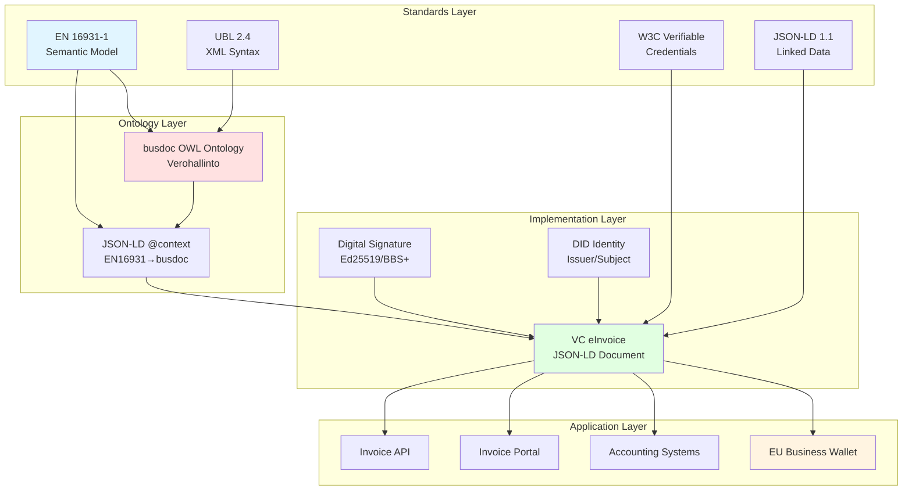
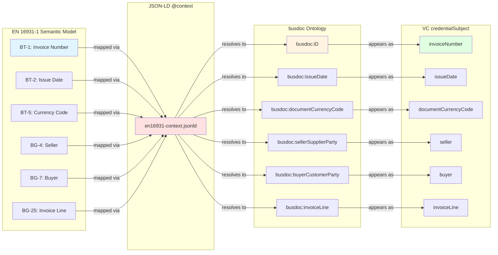
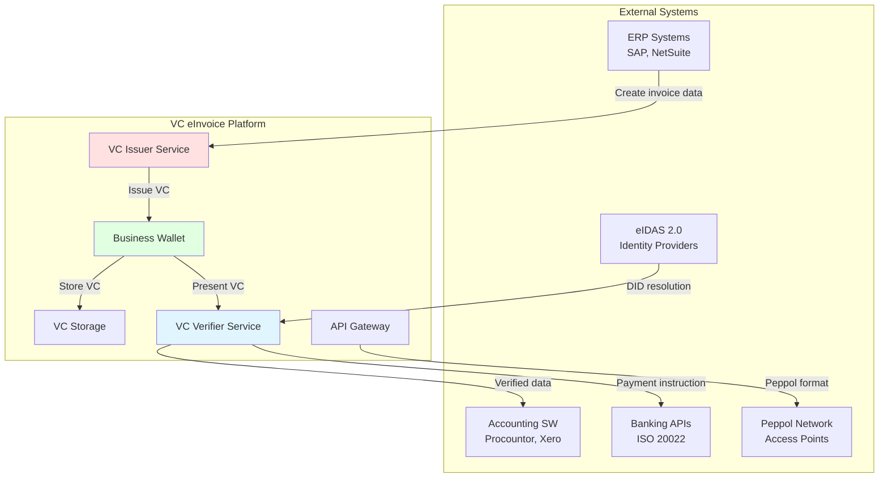
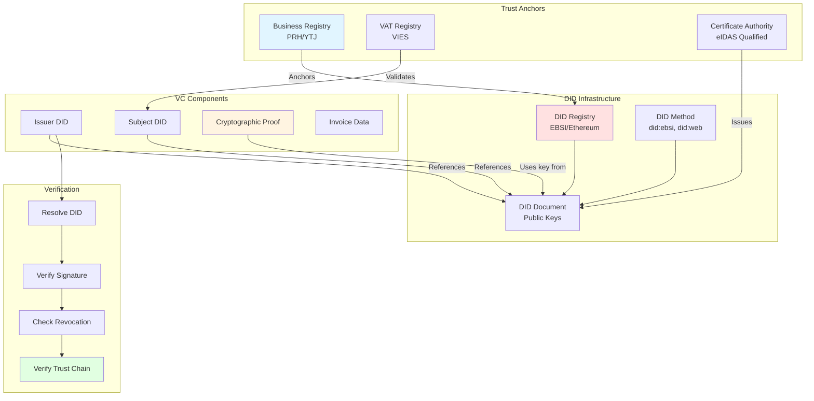

# W3C VC eInvoice Architecture

## Overall Architecture



## W3C VC Structure

```mermaid
graph TB
    VC[Verifiable Credential]
    
    VC --> CONTEXT[@context]
    VC --> TYPE[type]
    VC --> ID[id]
    VC --> ISSUER[issuer]
    VC --> ISSUED[issuanceDate]
    VC --> EXPIRES[expirationDate]
    VC --> SUBJECT[credentialSubject]
    VC --> PROOF[proof]
    
    CONTEXT --> VC_CONTEXT[W3C VC Context]
    CONTEXT --> EN_CONTEXT[EN16931 Context]
    
    TYPE --> VC_TYPE[VerifiableCredential]
    TYPE --> INVOICE_TYPE[EN16931Invoice]
    
    ISSUER --> DID[did:example:seller123]
    ISSUER --> NAME[Issuer Name]
    ISSUER --> VAT[VAT ID]
    
    SUBJECT --> INVOICE[Invoice Data]
    INVOICE --> HEADER[Header Info]
    INVOICE --> SELLER[Seller Party]
    INVOICE --> BUYER[Buyer Party]
    INVOICE --> DELIVERY[Delivery]
    INVOICE --> PAYMENT[Payment Means]
    INVOICE --> TAX[Tax Total]
    INVOICE --> TOTALS[Monetary Total]
    INVOICE --> LINES[Invoice Lines]
    
    PROOF --> SIG_TYPE[Ed25519Signature2020]
    PROOF --> CREATED[Signature Date]
    PROOF --> METHOD[Verification Method]
    PROOF --> PURPOSE[Proof Purpose]
    PROOF --> VALUE[Signature Value]
    
    style VC fill:#e1f5ff
    style SUBJECT fill:#e1ffe1
    style PROOF fill:#ffe1e1
```

## EN 16931-1 Semantic to VC Mapping



## Invoice Lifecycle with VCs

```mermaid
sequenceDiagram
    participant Seller
    participant SellerWallet as Seller's Business Wallet
    participant Network as Invoice Network
    participant BuyerWallet as Buyer's Business Wallet
    participant Buyer
    participant Verifier as Tax Authority/Auditor
    
    Note over Seller,Buyer: 1. Invoice Creation
    Seller->>SellerWallet: Create invoice data (EN 16931-1)
    SellerWallet->>SellerWallet: Wrap as VC credentialSubject
    SellerWallet->>SellerWallet: Sign with seller's DID key
    SellerWallet->>SellerWallet: Generate VC with proof
    
    Note over Seller,Buyer: 2. Invoice Transmission
    SellerWallet->>Network: Send VC invoice
    Network->>BuyerWallet: Deliver VC invoice
    
    Note over Seller,Buyer: 3. Invoice Verification
    BuyerWallet->>BuyerWallet: Resolve seller's DID document
    BuyerWallet->>BuyerWallet: Verify cryptographic signature
    BuyerWallet->>BuyerWallet: Validate EN 16931-1 rules
    BuyerWallet->>Buyer: Present verified invoice
    
    Note over Seller,Buyer: 4. Payment Processing
    Buyer->>BuyerWallet: Approve payment
    BuyerWallet->>Network: Initiate payment (ISO 20022)
    Network->>SellerWallet: Payment confirmation
    
    Note over Seller,Verifier: 5. Audit/Compliance
    Verifier->>Network: Request invoice VC
    Network->>Verifier: Provide VC invoice
    Verifier->>Verifier: Verify signature
    Verifier->>Verifier: Extract and analyze data
    Verifier->>Verifier: Compliance check passed ✓
    
    style Seller fill:#e1f5ff
    style SellerWallet fill:#ffe1e1
    style BuyerWallet fill:#ffe1e1
    style Buyer fill:#e1f5ff
    style Verifier fill:#fff4e1
```

## Data Flow: XML UBL vs JSON-LD VC

```mermaid
graph TB
    subgraph "Traditional UBL Flow"
        XML_CREATE[Create UBL Invoice<br/>XML]
        XML_SIGN[Optional XML Signature]
        XML_SEND[Send via Peppol/AS4]
        XML_RECEIVE[Receive XML]
        XML_PARSE[Parse XML]
        XML_VALIDATE[XSD/Schematron<br/>Validation]
        XML_EXTRACT[Extract to DB]
        
        XML_CREATE --> XML_SIGN
        XML_SIGN --> XML_SEND
        XML_SEND --> XML_RECEIVE
        XML_RECEIVE --> XML_PARSE
        XML_PARSE --> XML_VALIDATE
        XML_VALIDATE --> XML_EXTRACT
    end
    
    subgraph "VC JSON-LD Flow"
        VC_CREATE[Create Invoice Data<br/>JSON]
        VC_WRAP[Wrap as VC<br/>credentialSubject]
        VC_SIGN[Sign with DID Key<br/>Ed25519/BBS+]
        VC_SEND[Store in Wallet<br/>or Send]
        VC_RECEIVE[Receive VC]
        VC_VERIFY[Verify Signature<br/>via DID Resolution]
        VC_VALIDATE[Validate JSON Schema<br/>& Business Rules]
        VC_EXTRACT[Extract credentialSubject]
        
        VC_CREATE --> VC_WRAP
        VC_WRAP --> VC_SIGN
        VC_SIGN --> VC_SEND
        VC_SEND --> VC_RECEIVE
        VC_RECEIVE --> VC_VERIFY
        VC_VERIFY --> VC_VALIDATE
        VC_VALIDATE --> VC_EXTRACT
    end
    
    style XML_CREATE fill:#e1f5ff
    style VC_CREATE fill:#e1ffe1
    style XML_SIGN fill:#ffe1e1
    style VC_SIGN fill:#ffe1e1
```



## Integration Points



## Security & Trust Model



## Comparison: Traditional vs VC eInvoice

| Aspect | Traditional UBL XML | W3C VC JSON-LD |
|--------|-------------------|----------------|
| **Format** | XML (verbose) | JSON (concise) |
| **Semantic Layer** | XSD schemas | JSON-LD + OWL ontology |
| **Identity** | X.509 certificates | DIDs (decentralized) |
| **Signature** | XMLDSig | JSON-LD proof (Ed25519, BBS+) |
| **Transport** | Peppol AS4, SFTP | HTTPS, DIDComm, Wallet |
| **Verification** | CA chain of trust | DID resolution + crypto |
| **Selective Disclosure** | Not supported | BBS+ signatures |
| **Revocation** | CRL/OCSP | StatusList2021 |
| **Interoperability** | UBL 2.x versions | Linked Data (IRIs) |
| **Wallet Support** | No | Native |
| **Web3 Ready** | No | Yes |

## Implementation Checklist

### Phase 1: Foundation ✅
- [x] JSON-LD @context creation
- [x] W3C VC structure definition
- [x] Example invoice with all EN 16931-1 elements
- [x] Documentation and architecture diagrams

### Phase 2: Validation (Next)
- [ ] JSON Schema for structure validation
- [ ] Business rule validation engine
- [ ] EN 16931-1 cardinality checks
- [ ] Unit tests for validation

### Phase 3: Cryptography
- [ ] DID key generation utilities
- [ ] Ed25519 signature implementation
- [ ] BBS+ signature support (selective disclosure)
- [ ] Signature verification library

### Phase 4: Integration
- [ ] EU Business Wallet adapter
- [ ] ERP system connectors
- [ ] Peppol Access Point bridge
- [ ] ISO 20022 payment integration

### Phase 5: Production
- [ ] DID registry integration (EBSI)
- [ ] Revocation mechanism
- [ ] Audit logging
- [ ] Performance optimization
- [ ] Security hardening

---

**Last Updated**: 2024-03-12  
**Version**: 0.1.0 (Draft)
