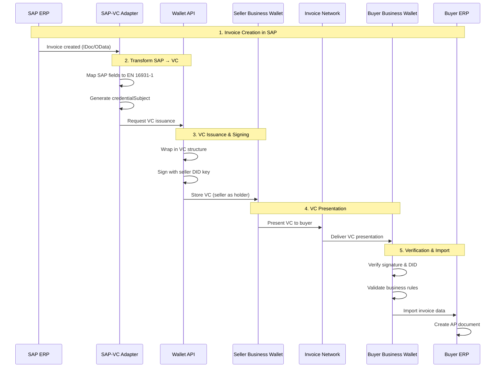

# W3C VC eInvoice Implementation Process

**From SAP Invoice to Verifiable Credential**

## Executive Summary

This document defines the end-to-end process for implementing W3C Verifiable Credentials for electronic invoices, from SAP ERP creation through to digital business wallet issuance and verification.

### Key Architectural Decision

**Issuance Model**: **Self-Issued VC (Seller as Holder)** with Presentation to Buyer

**Rationale**: The invoice is a **claim made by the seller**, not a credential issued to the buyer. The seller must retain canonical proof of issuance for tax, accounting, and audit purposes.

---

## Table of Contents

1. [Issuance Model Analysis](#issuance-model-analysis)
2. [Process Overview](#process-overview)
3. [System Architecture](#system-architecture)
4. [Component Specifications](#component-specifications)
5. [Process Flow Detailed](#process-flow-detailed)
6. [Data Mapping](#data-mapping)
7. [Integration Points](#integration-points)
8. [Security Considerations](#security-considerations)

---

## 1. Issuance Model Analysis

### Option A: Self-Issued VC (Seller as Holder) ✅ RECOMMENDED

```
┌─────────────┐                    ┌─────────────┐
│   Seller    │                    │    Buyer    │
│  (Issuer &  │──── Presents ────→ │ (Verifier)  │
│   Holder)   │                    │             │
└─────────────┘                    └─────────────┘
      │                                   │
      │ Holds canonical VC                │ Receives copy
      │ in seller wallet                  │ for processing
```

**Characteristics**:
- **Holder**: Seller
- **Subject**: The invoice (transaction)
- **Audience**: Buyer, tax authority, auditors, factoring companies

**Advantages**:
- ✅ Seller retains proof of issuance (required for tax law)
- ✅ Can present to multiple parties (buyer, tax office, bank)
- ✅ Selective disclosure possible (hide commercial terms from tax office)
- ✅ Seller controls revocation/amendment
- ✅ Aligns with legal requirement: seller must retain invoice copies
- ✅ Factoring-friendly: seller presents to factor without buyer involvement
- ✅ Single source of truth: seller's wallet is canonical

**Legal Compliance**:
- 🇪🇺 **EU VAT Directive**: Seller must keep invoice copies for 10 years
- 🇫🇮 **Finnish Accounting Act**: Seller's books are primary evidence
- 🇩🇪 **German HGB**: Seller must prove invoice issuance

**Use Case Example**:
1. Seller issues invoice VC (holder: seller)
2. Seller presents to buyer via secure channel
3. Buyer verifies and imports to their system
4. Seller presents same VC to tax authority for VAT reporting
5. Seller presents to factor for invoice financing
6. Each party verifies the signature independently

---

### Option B: Direct Issuance to Buyer (Buyer as Holder) ❌ NOT RECOMMENDED

```
┌─────────────┐                    ┌─────────────┐
│   Seller    │                    │    Buyer    │
│  (Issuer)   │───── Issues ─────→ │ (Holder)    │
│             │                    │             │
└─────────────┘                    └─────────────┘
      │                                   │
      │ No canonical copy              │ Holds VC
      │ (only in ledger)               │ as evidence
```

**Characteristics**:
- **Holder**: Buyer
- **Subject**: The invoice
- **Audience**: Buyer only

**Disadvantages**:
- ❌ Seller has no retained proof (legal requirement violation)
- ❌ Cannot present to third parties (tax office, banks)
- ❌ Buyer could refuse to accept (no delivery guarantee)
- ❌ Complicates factoring (seller doesn't hold the claim)
- ❌ Amendment requires buyer cooperation
- ❌ Revocation requires buyer deletion

**Legal Issues**:
- 🇪🇺 **VAT Directive**: Seller cannot prove they issued the invoice
- 🇫🇮 **Accounting Act**: Missing required documentation
- Tax audit failure risk

---

### Option C: Hybrid Model (Dual Holders) ⚠️ COMPLEX

```
┌─────────────┐                    ┌─────────────┐
│   Seller    │                    │    Buyer    │
│  (Issuer &  │──── Issues to ───→ │ (Holder)    │
│   Holder)   │                    │             │
└─────────────┘                    └─────────────┘
      │                                   │
      │ Holds master VC                │ Holds copy VC
      │ in seller wallet               │ in buyer wallet
```

**Characteristics**:
- **Holders**: Both parties
- **Implementation**: Two VCs or one with dual-holder semantics

**Disadvantages**:
- ⚠️ Synchronization complexity (which is canonical?)
- ⚠️ Revocation requires both parties
- ⚠️ Amendment workflow unclear
- ⚠️ Increased storage and management overhead

---

## 2. Process Overview

### High-Level Flow (Recommended Model)



---

## 3. System Architecture

### Component Stack

```
┌─────────────────────────────────────────────────────────────────┐
│                    Business Application Layer                     │
├─────────────────────────────────────────────────────────────────┤
│  SAP ERP  │  NetSuite  │  Dynamics 365  │  Other ERP Systems   │
└─────────────────────────────────────────────────────────────────┘
                              ↓↑
┌─────────────────────────────────────────────────────────────────┐
│                      Integration Layer                            │
├─────────────────────────────────────────────────────────────────┤
│  SAP-VC Adapter  │  REST API Gateway  │  Message Queue (AMQP)  │
└─────────────────────────────────────────────────────────────────┘
                              ↓↑
┌─────────────────────────────────────────────────────────────────┐
│                    VC Processing Layer                            │
├─────────────────────────────────────────────────────────────────┤
│  VC Issuer Service  │  VC Verifier Service  │  DID Resolver    │
│  Schema Validator   │  Business Rules Engine │  Key Management  │
└─────────────────────────────────────────────────────────────────┘
                              ↓↑
┌─────────────────────────────────────────────────────────────────┐
│                   Digital Wallet Layer                            │
├─────────────────────────────────────────────────────────────────┤
│  EU Business Wallet  │  Wallet API  │  Credential Storage       │
│  DIDComm Agent      │  Presentation Protocol  │  Backup/Recovery │
└─────────────────────────────────────────────────────────────────┘
                              ↓↑
┌─────────────────────────────────────────────────────────────────┐
│                   Identity & Trust Layer                          │
├─────────────────────────────────────────────────────────────────┤
│  DID Registry (EBSI)  │  eIDAS 2.0  │  Business Registry (YTJ) │
│  Trust Framework      │  Revocation Registry  │  Key Recovery   │
└─────────────────────────────────────────────────────────────────┘
                              ↓↑
┌─────────────────────────────────────────────────────────────────┐
│                    Network & Transport Layer                      │
├─────────────────────────────────────────────────────────────────┤
│  DIDComm v2  │  HTTPS/REST  │  Peppol Network  │  EDI Gateway  │
└─────────────────────────────────────────────────────────────────┘
```

---

## 4. Component Specifications

### 4.1 SAP-VC Adapter

**Purpose**: Bridge SAP ERP and W3C VC ecosystem

**Functionality**:
- Listen to SAP invoice creation events (IDoc, BAPI, OData)
- Extract invoice data from SAP tables (VBRK, VBRP, KNA1, etc.)
- Map SAP fields to EN 16931-1 semantic model
- Generate credentialSubject JSON-LD
- Call VC Issuer Service API
- Update SAP with VC reference ID

**Technology Stack**:
- **Language**: Node.js / Java / ABAP
- **SAP Connectivity**: SAP JCo (Java Connector) / SAP Cloud SDK
- **API**: REST/GraphQL client
- **Message Queue**: RabbitMQ / Apache Kafka

**Configuration**:
```yaml
sap_adapter:
  sap_connection:
    host: sap.example.com
    client: "100"
    system_number: "00"
    user: VC_ADAPTER_USER
    
  event_listeners:
    - idoc_type: INVOIC02
      message_type: INVOIC
      trigger: on_invoice_release
    
  field_mappings:
    - sap_field: VBRK-VBELN
      vc_field: invoiceNumber
      transformation: none
    
    - sap_field: VBRK-FKDAT
      vc_field: issueDate
      transformation: date_iso8601
      
  vc_issuer_api:
    url: https://wallet-api.example.com/v1/issue
    authentication: oauth2
    
  storage:
    vc_reference_field: VBRK-ZZCRED_ID
```

---

### 4.2 VC Issuer Service

**Purpose**: Create and sign W3C Verifiable Credentials

**Functionality**:
- Accept credentialSubject from adapter
- Load issuer DID from Key Management Service
- Wrap in W3C VC structure
- Add @context references (W3C VC + EN 16931-1)
- Sign with Ed25519 key
- Store in wallet
- Return VC to caller

**Technology Stack**:
- **Language**: TypeScript / Python
- **Framework**: Fastify / FastAPI
- **VC Library**: `@digitalbazaar/vc` / `aries-framework-javascript`
- **DID Library**: `did-resolver`
- **Signature**: `@digitalbazaar/ed25519-signature-2020`

**API Specification**:

```typescript
// POST /v1/issue
interface IssueRequest {
  credentialSubject: object;        // Invoice data (EN 16931-1 format)
  issuerDid: string;                // did:example:seller123
  expirationDate?: string;          // ISO 8601
  context?: string[];               // Additional @context
  type?: string[];                  // Additional types
}

interface IssueResponse {
  verifiableCredential: object;     // Complete W3C VC
  credentialId: string;             // VC identifier
  issuerProof: string;              // Signature value
  storedAt: string;                 // Timestamp
}
```

**Example Usage**:

```typescript
import { issue } from '@digitalbazaar/vc';
import { Ed25519Signature2020 } from '@digitalbazaar/ed25519-signature-2020';

async function issueInvoiceVC(credentialSubject, issuerDid) {
  const credential = {
    '@context': [
      'https://www.w3.org/2018/credentials/v1',
      'https://iri.suomi.fi/model/vc-einvoice-en16931/context/v1'
    ],
    type: ['VerifiableCredential', 'EN16931Invoice'],
    issuer: issuerDid,
    issuanceDate: new Date().toISOString(),
    credentialSubject: credentialSubject
  };

  const suite = new Ed25519Signature2020({
    key: await loadKey(issuerDid)
  });

  const verifiableCredential = await issue({
    credential,
    suite,
    documentLoader
  });

  return verifiableCredential;
}
```

---

### 4.3 Digital Business Wallet

**Purpose**: Store, manage, and present Verifiable Credentials

**Core Features**:

#### Storage
- Encrypted credential vault
- Indexing by issuer, type, date
- Search and filter capabilities
- Backup and recovery

#### Presentation
- DIDComm v2 protocol support
- Selective disclosure (BBS+ signatures)
- Proof of possession
- Audit logging

#### Management
- Credential lifecycle (active, expired, revoked)
- Revocation checking
- Automatic expiry handling
- Archival

**EU Business Wallet Requirements**:
- ✅ eIDAS 2.0 compliant
- ✅ EBSI integration
- ✅ EU Digital Identity Wallet architecture
- ✅ Person Identification Data (PID) support
- ✅ Organizational credentials
- ✅ Qualified Electronic Attestation of Attributes (QEAA)

**Implementation Options**:

| Vendor | Type | Description |
|--------|------|-------------|
| **Jolocom** | Open-source | Self-sovereign identity wallet |
| **Sphereon** | Commercial | Enterprise SSI solutions |
| **MATTR** | Platform | DID & VC infrastructure |
| **Lissi** | EU-focused | German SSI wallet |
| **Trinsic** | Cloud | Hosted wallet service |

---

### 4.4 DID Resolver

**Purpose**: Resolve DIDs to DID Documents for verification

**Functionality**:
- Resolve `did:ebsi:*` (EBSI)
- Resolve `did:web:*` (DNS-based)
- Resolve `did:key:*` (self-contained)
- Cache DID Documents
- Handle DID method upgrades

**Technology Stack**:
- **Library**: `did-resolver`
- **Methods**: `ebsi-did-resolver`, `web-did-resolver`
- **Cache**: Redis / In-memory

**Example**:

```typescript
import { Resolver } from 'did-resolver';
import { getResolver as getEbsiResolver } from 'ebsi-did-resolver';
import { getResolver as getWebResolver } from 'web-did-resolver';

const resolver = new Resolver({
  ...getEbsiResolver(),
  ...getWebResolver()
});

async function resolveDID(did: string) {
  const didDocument = await resolver.resolve(did);
  return didDocument;
}
```

---

### 4.5 Business Rules Engine

**Purpose**: Validate invoices against business and regulatory rules

**Rules Categories**:

#### EN 16931-1 Cardinality Rules
```yaml
rules:
  - id: BT-1-MANDATORY
    description: Invoice number must be present
    field: invoiceNumber
    constraint: required
    
  - id: BT-5-MANDATORY
    description: Invoice currency code must be present
    field: documentCurrencyCode
    constraint: required
    pattern: ^[A-Z]{3}$
```

#### VAT Validation Rules
```yaml
rules:
  - id: VAT-CALCULATION
    description: VAT amount must equal taxable amount × rate
    validation: |
      taxSubtotal.taxAmount == 
        (taxSubtotal.taxableAmount * taxSubtotal.taxCategory.percent / 100)
    tolerance: 0.01
    
  - id: VAT-TOTAL
    description: Total VAT must equal sum of subtotals
    validation: |
      taxTotal.taxAmount == sum(taxSubtotal[].taxAmount)
```

#### Business Logic Rules
```yaml
rules:
  - id: PAYMENT-DUE-DATE
    description: Payment due date must be after issue date
    validation: |
      dueDate > issueDate
    
  - id: BUYER-REFERENCE
    description: Buyer reference or PO reference required
    validation: |
      buyerReference != null OR 
      purchaseOrderReference != null
```

**Implementation**:

```typescript
import Ajv from 'ajv';
import { EN16931Schema } from './schemas/en16931-schema';

class BusinessRulesEngine {
  private ajv: Ajv;
  
  constructor() {
    this.ajv = new Ajv({ allErrors: true });
  }
  
  validate(invoice: object): ValidationResult {
    // Schema validation
    const schemaValid = this.ajv.validate(EN16931Schema, invoice);
    
    // Business rules
    const businessRulesValid = this.validateBusinessRules(invoice);
    
    // VAT calculations
    const vatValid = this.validateVAT(invoice);
    
    return {
      valid: schemaValid && businessRulesValid && vatValid,
      errors: [
        ...this.ajv.errors || [],
        ...this.businessRuleErrors,
        ...this.vatErrors
      ]
    };
  }
}
```

---

## 5. Process Flow Detailed

### Phase 1: Invoice Creation in SAP

**Steps**:
1. User creates invoice in SAP (VF01/VF02)
2. Invoice saved to tables (VBRK header, VBRP items)
3. Release for accounting posted
4. SAP triggers event (IDoc INVOIC02)

**SAP Tables Referenced**:
- `VBRK` - Billing document header
- `VBRP` - Billing document items
- `KNA1` - Customer master
- `LFA1` - Vendor master (if dropship)
- `KONV` - Pricing conditions
- `BSEG` - Accounting document segments

**Event Payload (IDoc)**:
```xml
<IDOC>
  <E1EDK01>
    <BELNR>90123456</BELNR>        <!-- Invoice number -->
    <DATUM>20240312</DATUM>         <!-- Invoice date -->
    <WAERS>EUR</WAERS>              <!-- Currency -->
  </E1EDK01>
  <E1EDKA1>                          <!-- Partner data -->
    <PARVW>AG</PARVW>               <!-- Sold-to party -->
    <PARTN>1000123</PARTN>          <!-- Customer number -->
  </E1EDKA1>
  <!-- ... more segments ... -->
</IDOC>
```

---

### Phase 2: SAP-VC Adapter Processing

**Steps**:

1. **Event Reception**
```typescript
adapter.on('idoc:INVOIC02', async (idoc) => {
  console.log('Received invoice IDoc:', idoc.docnum);
  
  // Extract invoice number
  const invoiceNumber = idoc.E1EDK01.BELNR;
  
  // Fetch full invoice data from SAP
  const sapInvoice = await sapClient.readInvoice(invoiceNumber);
  
  // Transform to VC format
  const credentialSubject = await transformToVC(sapInvoice);
  
  // Issue VC
  const vc = await issueVC(credentialSubject);
  
  // Update SAP with VC reference
  await sapClient.updateInvoice(invoiceNumber, {
    ZZCRED_ID: vc.id
  });
});
```

2. **Data Extraction**
```typescript
async function fetchInvoiceFromSAP(invoiceNumber: string) {
  const query = `
    SELECT 
      v.VBELN,      -- Invoice number
      v.FKDAT,      -- Invoice date
      v.FKART,      -- Invoice type
      v.WAERK,      -- Currency
      v.KUNAG,      -- Sold-to party
      v.KUNRG,      -- Bill-to party
      k.NAME1,      -- Customer name
      k.STRAS,      -- Street
      k.ORT01,      -- City
      k.PSTLZ,      -- Postal code
      k.LAND1       -- Country
    FROM VBRK v
    JOIN KNA1 k ON v.KUNAG = k.KUNNR
    WHERE v.VBELN = :invoiceNumber
  `;
  
  return await sapClient.execute(query, { invoiceNumber });
}
```

3. **Field Mapping**
```typescript
function transformToVC(sapInvoice: SAPInvoice): InvoiceCredentialSubject {
  return {
    type: 'Invoice',
    invoiceNumber: sapInvoice.VBELN.trim(),
    issueDate: formatDate(sapInvoice.FKDAT),
    invoiceTypeCode: mapInvoiceType(sapInvoice.FKART),
    documentCurrencyCode: sapInvoice.WAERK,
    
    seller: {
      type: 'Party',
      name: sapInvoice.seller.NAME1,
      address: {
        type: 'PostalAddress',
        streetName: sapInvoice.seller.STRAS,
        cityName: sapInvoice.seller.ORT01,
        postalZone: sapInvoice.seller.PSTLZ,
        country: { identificationCode: sapInvoice.seller.LAND1 }
      }
    },
    
    buyer: {
      type: 'Party',
      name: sapInvoice.buyer.NAME1,
      address: {
        type: 'PostalAddress',
        streetName: sapInvoice.buyer.STRAS,
        cityName: sapInvoice.buyer.ORT01,
        postalZone: sapInvoice.buyer.PSTLZ,
        country: { identificationCode: sapInvoice.buyer.LAND1 }
      }
    },
    
    invoiceLine: sapInvoice.items.map(item => ({
      lineID: item.POSNR,
      invoicedQuantity: {
        value: item.FKIMG,
        unitCode: item.VRKME
      },
      lineExtensionAmount: item.NETWR,
      item: {
        name: item.ARKTX,
        sellersItemIdentification: { id: item.MATNR }
      },
      price: {
        priceAmount: item.NETPR
      }
    })),
    
    legalMonetaryTotal: {
      lineExtensionAmount: sapInvoice.NETWR,
      taxExclusiveAmount: sapInvoice.NETWR,
      taxInclusiveAmount: sapInvoice.NETWR + sapInvoice.MWSBP,
      payableAmount: sapInvoice.NETWR + sapInvoice.MWSBP
    },
    
    taxTotal: {
      taxAmount: sapInvoice.MWSBP,
      taxSubtotal: sapInvoice.taxLines.map(tax => ({
        taxableAmount: tax.KAWRT,
        taxAmount: tax.KWERT,
        taxCategory: {
          taxCategoryID: tax.MWSKZ,
          percent: tax.MSATZ,
          taxScheme: { id: 'VAT' }
        }
      }))
    }
  };
}
```

---

### Phase 3: VC Issuance & Signing

**Steps**:

1. **Load Issuer Identity**
```typescript
async function loadIssuerDID() {
  // Retrieve from HSM or Key Management Service
  const issuerDID = await kms.getDID('seller-company-did');
  const privateKey = await kms.getPrivateKey(issuerDID);
  
  return {
    did: issuerDID,
    key: privateKey
  };
}
```

2. **Create VC Structure**
```typescript
const credential = {
  '@context': [
    'https://www.w3.org/2018/credentials/v1',
    'https://iri.suomi.fi/model/vc-einvoice-en16931/context/v1'
  ],
  type: ['VerifiableCredential', 'EN16931Invoice'],
  id: `urn:invoice:${invoiceNumber}`,
  issuer: {
    id: issuerDID,
    name: 'Example Company Oy',
    vatID: 'FI12345678'
  },
  issuanceDate: new Date().toISOString(),
  expirationDate: addMonths(new Date(), 3).toISOString(),
  credentialSubject: credentialSubject
};
```

3. **Sign with Ed25519**
```typescript
import { Ed25519Signature2020 } from '@digitalbazaar/ed25519-signature-2020';

const suite = new Ed25519Signature2020({
  key: await Ed25519VerificationKey2020.from({
    ...issuerKey,
    controller: issuerDID
  })
});

const verifiableCredential = await issue({
  credential,
  suite,
  documentLoader: customDocumentLoader
});
```

4. **Store in Wallet**
```typescript
await wallet.store({
  credential: verifiableCredential,
  tags: {
    type: 'invoice',
    invoiceNumber: invoiceNumber,
    buyer: credentialSubject.buyer.id,
    amount: credentialSubject.legalMonetaryTotal.payableAmount,
    currency: credentialSubject.documentCurrencyCode,
    status: 'issued'
  }
});
```

---

### Phase 4: VC Presentation to Buyer

**Methods**:

#### Method 1: DIDComm v2 (Peer-to-Peer)

```typescript
import { DIDComm } from 'didcomm';

async function presentToB buyer(vc: VerifiableCredential, buyerDID: string) {
  const presentation = {
    '@context': ['https://www.w3.org/2018/credentials/v1'],
    type: ['VerifiablePresentation'],
    holder: sellerDID,
    verifiableCredential: [vc]
  };
  
  // Sign presentation
  const vp = await signPresentation(presentation, sellerKey);
  
  // Send via DIDComm
  const message = {
    type: 'https://didcomm.org/present-proof/3.0/presentation',
    id: uuidv4(),
    body: {
      verifiable_presentation: vp
    },
    to: [buyerDID],
    from: sellerDID
  };
  
  await didcomm.send(message);
}
```

#### Method 2: REST API (Network Gateway)

```typescript
async function presentViaAPI(vc: VerifiableCredential, buyerEndpoint: string) {
  const response = await fetch(`${buyerEndpoint}/v1/invoices/receive`, {
    method: 'POST',
    headers: {
      'Content-Type': 'application/ld+json',
      'Authorization': `Bearer ${accessToken}`
    },
    body: JSON.stringify({
      verifiableCredential: vc,
      presentedBy: sellerDID,
      presentedAt: new Date().toISOString()
    })
  });
  
  return response.json();
}
```

#### Method 3: Peppol Network (Backward Compatibility)

```typescript
async function presentViaPeppol(vc: VerifiableCredential, buyerPeppolID: string) {
  // Extract UBL XML from VC
  const ublXML = await vcToUBL(vc);
  
  // Send via Peppol AS4
  await peppolClient.send({
    sender: sellerPeppolID,
    receiver: buyerPeppolID,
    documentType: 'urn:oasis:names:specification:ubl:schema:xsd:Invoice-2',
    processId: 'urn:fdc:peppol.eu:2017:poacc:billing:01:1.0',
    content: ublXML,
    
    // Attach VC as metadata
    metadata: {
      verifiableCredential: JSON.stringify(vc)
    }
  });
}
```

---

### Phase 5: Buyer Verification & Import

**Steps**:

1. **Receive VC**
```typescript
app.post('/v1/invoices/receive', async (req, res) => {
  const { verifiableCredential } = req.body;
  
  // Step 1: Verify cryptographic signature
  const verificationResult = await verifyVC(verifiableCredential);
  
  if (!verificationResult.verified) {
    return res.status(400).json({
      error: 'Invalid signature',
      details: verificationResult.error
    });
  }
  
  // Step 2: Verify issuer DID
  const issuerDID = verifiableCredential.issuer.id;
  const issuerTrusted = await verifyIssuerTrust(issuerDID);
  
  if (!issuerTrusted) {
    return res.status(403).json({
      error: 'Untrusted issuer',
      did: issuerDID
    });
  }
  
  // Step 3: Validate business rules
  const validationResult = await validateBusinessRules(
    verifiableCredential.credentialSubject
  );
  
  if (!validationResult.valid) {
    return res.status(422).json({
      error: 'Business rule validation failed',
      errors: validationResult.errors
    });
  }
  
  // Step 4: Store in buyer wallet
  await buyerWallet.store(verifiableCredential);
  
  // Step 5: Import to ERP
  const erpDocument = await importToERP(verifiableCredential);
  
  res.json({
    status: 'accepted',
    erpDocumentId: erpDocument.id
  });
});
```

2. **Verify Signature**
```typescript
import { verify } from '@digitalbazaar/vc';

async function verifyVC(vc: VerifiableCredential) {
  const result = await verify({
    credential: vc,
    suite: new Ed25519Signature2020(),
    documentLoader: customDocumentLoader
  });
  
  return {
    verified: result.verified,
    error: result.error,
    issuer: result.results[0].proof.verificationMethod
  };
}
```

3. **Verify Issuer Trust**
```typescript
async function verifyIssuerTrust(issuerDID: string): Promise<boolean> {
  // Resolve DID Document
  const didDocument = await didResolver.resolve(issuerDID);
  
  // Check if DID is registered in trusted registry (e.g., YTJ)
  const businessRegistry = await ytj.lookup(didDocument.alsoKnownAs);
  
  if (!businessRegistry.active) {
    return false;
  }
  
  // Check if in buyer's approved seller list
  const approvedSeller = await db.sellers.findOne({
    did: issuerDID,
    status: 'approved'
  });
  
  return approvedSeller !== null;
}
```

4. **Import to Buyer ERP**
```typescript
async function importToERP(vc: VerifiableCredential) {
  const invoice = vc.credentialSubject;
  
  // Map to ERP format
  const erpInvoice = {
    vendor_invoice_number: invoice.invoiceNumber,
    invoice_date: invoice.issueDate,
    due_date: invoice.dueDate,
    currency: invoice.documentCurrencyCode,
    
    vendor: {
      id: await lookupVendorId(invoice.seller.vatID),
      name: invoice.seller.name
    },
    
    line_items: invoice.invoiceLine.map(line => ({
      description: line.item.name,
      quantity: line.invoicedQuantity.value,
      unit_price: line.price.priceAmount,
      amount: line.lineExtensionAmount,
      gl_account: await mapGLAccount(line.item.sellersItemIdentification.id)
    })),
    
    total_net: invoice.legalMonetaryTotal.taxExclusiveAmount,
    total_vat: invoice.taxTotal.taxAmount,
    total_gross: invoice.legalMonetaryTotal.payableAmount,
    
    // Reference to original VC
    vc_id: vc.id,
    vc_issuer: vc.issuer.id
  };
  
  // Create AP document in ERP
  return await erpClient.createVendorInvoice(erpInvoice);
}
```

---

## 6. Data Mapping

### SAP → EN 16931-1 → W3C VC

| SAP Field | Table | EN 16931-1 Element | W3C VC Path |
|-----------|-------|-------------------|-------------|
| `VBELN` | VBRK | BT-1: Invoice number | `credentialSubject.invoiceNumber` |
| `FKDAT` | VBRK | BT-2: Invoice issue date | `credentialSubject.issueDate` |
| `FKART` | VBRK | BT-3: Invoice type code | `credentialSubject.invoiceTypeCode` |
| `WAERK` | VBRK | BT-5: Invoice currency | `credentialSubject.documentCurrencyCode` |
| `ZTERM` | VBRK | BT-20: Payment terms | `credentialSubject.paymentTerms.note` |
| `KUNAG` | VBRK | BG-7: Buyer | `credentialSubject.buyer.id` |
| `NAME1` | KNA1 | BT-44: Buyer name | `credentialSubject.buyer.name` |
| `STRAS` | KNA1 | BT-50: Buyer address line 1 | `credentialSubject.buyer.address.streetName` |
| `ORT01` | KNA1 | BT-52: Buyer city | `credentialSubject.buyer.address.cityName` |
| `PSTLZ` | KNA1 | BT-53: Buyer post code | `credentialSubject.buyer.address.postalZone` |
| `LAND1` | KNA1 | BT-55: Buyer country | `credentialSubject.buyer.address.country.identificationCode` |
| `POSNR` | VBRP | BT-126: Invoice line ID | `credentialSubject.invoiceLine[].lineID` |
| `FKIMG` | VBRP | BT-129: Invoiced quantity | `credentialSubject.invoiceLine[].invoicedQuantity.value` |
| `VRKME` | VBRP | BT-130: Unit of measure | `credentialSubject.invoiceLine[].invoicedQuantity.unitCode` |
| `NETWR` | VBRP | BT-131: Line net amount | `credentialSubject.invoiceLine[].lineExtensionAmount` |
| `MATNR` | VBRP | BT-155: Item seller ID | `credentialSubject.invoiceLine[].item.sellersItemIdentification.id` |
| `ARKTX` | VBRP | BT-153: Item name | `credentialSubject.invoiceLine[].item.name` |
| `MWSBP` | VBRK | BT-110: Total VAT amount | `credentialSubject.taxTotal.taxAmount` |

---

## 7. Integration Points

### 7.1 SAP Integration

**Outbound** (SAP → VC):
- IDoc (INVOIC02, ORDERS05)
- OData services
- RFC/BAPI calls
- Change pointers

**Inbound** (VC → SAP):
- IDoc (INVOIC02 for vendor invoices)
- Custom BAPI (Z_VC_IMPORT_INVOICE)
- OData create/update

### 7.2 ERP-Agnostic Approach

```typescript
interface ERPAdapter {
  // Read invoice data
  fetchInvoice(id: string): Promise<Invoice>;
  
  // Write VC reference
  updateInvoiceVCRef(id: string, vcId: string): Promise<void>;
  
  // Import received invoice
  createVendorInvoice(invoice: Invoice): Promise<string>;
  
  // Query capabilities
  searchInvoices(criteria: SearchCriteria): Promise<Invoice[]>;
}

// Implementations
class SAPAdapter implements ERPAdapter { /* ... */ }
class NetSuiteAdapter implements ERPAdapter { /* ... */ }
class Dynamics365Adapter implements ERPAdapter { /* ... */ }
```

---

## 8. Security Considerations

### 8.1 Key Management

**Requirements**:
- HSM (Hardware Security Module) for private keys
- Key rotation policy (annual)
- Multi-signature for high-value invoices
- Backup and recovery procedures

**Implementation**:
```typescript
import { AWSKMSClient } from '@aws-sdk/client-kms';

class KeyManagementService {
  async getPrivateKey(did: string): Promise<PrivateKey> {
    // Retrieve from AWS KMS
    const key = await kms.getKey({ KeyId: did });
    return Ed25519PrivateKey.from(key);
  }
  
  async rotateKey(oldDID: string): Promise<string> {
    // Generate new key
    const newKey = await kms.createKey();
    
    // Update DID Document
    await didRegistry.updateDIDDocument(oldDID, {
      verificationMethod: [
        // Add new key
        { id: newKey.id, ...newKey.publicKey },
        // Deprecate old key
        { id: oldDID, revoked: true }
      ]
    });
    
    return newKey.did;
  }
}
```

### 8.2 Access Control

**Role-Based Access Control (RBAC)**:

| Role | Permissions |
|------|-------------|
| **Invoice Clerk** | Create invoices, view own invoices |
| **Accountant** | View all invoices, approve, export |
| **Wallet Admin** | Manage DIDs, issue VCs, revoke |
| **Auditor** | Read-only access to all VCs |

### 8.3 Audit Trail

**Log Events**:
- VC issuance (who, when, invoice number)
- VC presentation (to whom, when)
- VC verification (result, verifier)
- VC revocation (reason, authorized by)

**Implementation**:
```typescript
await auditLog.record({
  event: 'vc.issued',
  actor: userId,
  subject: invoiceNumber,
  vcId: vc.id,
  timestamp: new Date(),
  metadata: {
    buyer: vc.credentialSubject.buyer.name,
    amount: vc.credentialSubject.legalMonetaryTotal.payableAmount
  }
});
```

---

## 9. Deployment Architecture

### 9.1 Infrastructure

```
┌─────────────────────────────────────────────────────────────────┐
│                         Cloud Infrastructure                      │
├─────────────────────────────────────────────────────────────────┤
│  Region: EU-North-1 (Finland) - GDPR Compliant                  │
│                                                                   │
│  ┌──────────────┐  ┌──────────────┐  ┌──────────────┐         │
│  │  SAP ERP     │  │  Adapter     │  │  VC Issuer   │         │
│  │  (On-Prem)   │──│  (Cloud)     │──│  (Cloud)     │         │
│  └──────────────┘  └──────────────┘  └──────────────┘         │
│         │                  │                  │                  │
│         └──────────────────┼──────────────────┘                 │
│                            │                                     │
│                  ┌──────────────────┐                           │
│                  │   Wallet API     │                           │
│                  │   (Kubernetes)   │                           │
│                  └──────────────────┘                           │
│                            │                                     │
│         ┌──────────────────┼──────────────────┐                │
│         │                  │                  │                 │
│  ┌──────────────┐  ┌──────────────┐  ┌──────────────┐         │
│  │  PostgreSQL  │  │    Redis     │  │   AWS KMS    │         │
│  │  (Metadata)  │  │   (Cache)    │  │  (Keys)      │         │
│  └──────────────┘  └──────────────┘  └──────────────┘         │
│                                                                   │
└─────────────────────────────────────────────────────────────────┘
                            │
                            ▼
┌─────────────────────────────────────────────────────────────────┐
│                     External Services                             │
├─────────────────────────────────────────────────────────────────┤
│  EBSI (DID Registry)  │  YTJ (Business Registry)  │  eIDAS     │
└─────────────────────────────────────────────────────────────────┘
```

### 9.2 Scalability

**Load Handling**:
- 10,000 invoices/day: Single instance
- 100,000 invoices/day: Horizontal scaling (3-5 instances)
- 1,000,000 invoices/day: Microservices + message queue

**Performance Targets**:
- VC issuance: < 500ms
- VC verification: < 200ms
- End-to-end (SAP → Buyer wallet): < 5 seconds

---

## 10. Cost Estimation

### 10.1 Infrastructure Costs (Monthly)

| Component | Configuration | Cost (EUR) |
|-----------|--------------|-----------|
| **Compute** | 2x t3.large (24/7) | €240 |
| **Database** | PostgreSQL RDS (100GB) | €120 |
| **Cache** | Redis ElastiCache | €60 |
| **Key Management** | AWS KMS (1000 keys) | €30 |
| **Storage** | S3 (1TB VCs) | €20 |
| **Network** | Data transfer (500GB) | €40 |
| **TOTAL** | | **€510/month** |

### 10.2 Transaction Costs

| Service | Cost per Transaction |
|---------|---------------------|
| **DID Resolution** | €0.001 (cached: €0.0001) |
| **VC Signature** | €0.01 (Ed25519) |
| **EBSI Anchoring** | €0.05 (optional) |
| **Avg per Invoice** | **€0.011 - €0.061** |

**Volume Pricing**:
- 1,000 invoices/month: €11-61/month
- 10,000 invoices/month: €110-610/month
- 100,000 invoices/month: €1,100-6,100/month

---

## 11. Implementation Timeline

### Phase 1: Proof of Concept (8 weeks)

**Week 1-2**: Architecture & Design
- Finalize data model
- API specifications
- Security architecture

**Week 3-4**: Core Components
- VC Issuer Service
- DID Resolver
- Basic wallet

**Week 5-6**: SAP Integration
- IDoc listener
- Field mapping
- Test with sample data

**Week 7-8**: Testing & Demo
- End-to-end testing
- Stakeholder demo
- Documentation

### Phase 2: Pilot (12 weeks)

**Week 9-12**: Production Setup
- Infrastructure provisioning
- Key management
- Security hardening

**Week 13-16**: Integration
- SAP production connection
- Buyer onboarding (5-10 companies)
- Monitoring setup

**Week 17-20**: Pilot Operation
- 1,000 real invoices
- Issue resolution
- Performance tuning

### Phase 3: Production (8 weeks)

**Week 21-24**: Scaling
- Multi-tenant architecture
- Additional ERP adapters
- Advanced features

**Week 25-28**: Rollout
- Full buyer network
- Training & support
- Go-live

**Total**: **28 weeks (7 months)**

---

## 12. Success Metrics

### Technical KPIs

- ✅ VC issuance success rate: > 99.9%
- ✅ Verification failure rate: < 0.1%
- ✅ Average issuance time: < 1 second
- ✅ System uptime: > 99.95%

### Business KPIs

- ✅ Invoice processing time reduction: > 50%
- ✅ Manual data entry elimination: > 95%
- ✅ Invoice disputes: < 1%
- ✅ Payment delay reduction: > 30%

### Adoption KPIs

- ✅ Seller adoption: > 80% within 6 months
- ✅ Buyer adoption: > 60% within 12 months
- ✅ VC invoices vs total: > 70% within 18 months

---

## Conclusion

**Recommended Approach**: **Self-Issued VC (Seller as Holder)** with presentation-based distribution to buyers.

This model ensures:
- ✅ Legal compliance (seller retains proof)
- ✅ Multi-party reusability (tax, banks, factoring)
- ✅ Seller control (amendments, revocations)
- ✅ Buyer verification (authentic, tamper-evident)
- ✅ Ecosystem compatibility (existing EDI networks)

The implementation provides a **production-ready path** from SAP invoice creation to W3C Verifiable Credential issuance, with clear integration points, security controls, and scalability considerations.

---

**Document Version**: 1.0  
**Last Updated**: 2024-03-12  
**Status**: Final Recommendation
